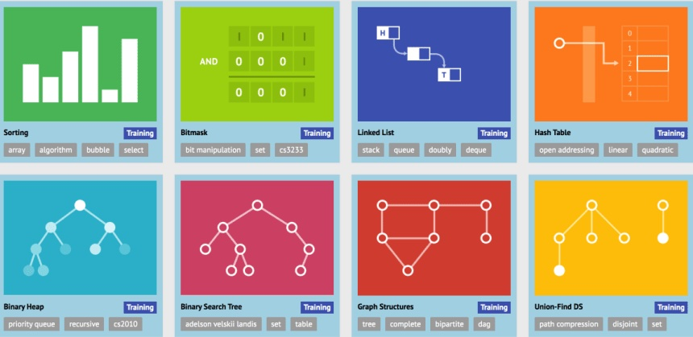

### About CS24: Problem Solving with Computers-II

Welcome to CS24! The goal of this class is to solve problems efficiently using data structures and algorithms. You'll learn about abstract data types e.g. stacks, queues, priority_queues, sets, and maps; the concrete data structures used to implement them, e.g. vectors, and binary trees; and how to reason about the complexity of the operations performed on the data structures. Another goal is to become proficient with coding in C++ and using the C++ Standard Template Library (STL) to succeed in technical coding interviews and future classes!

Interactive data structure visualizations from <a href="https://visualgo.net/" target="_blank">VisuAlgo</a>

---

**Instructor:** {{site.instructor}} &nbsp; | &nbsp; **Office Hours:** {{site.office_hours}}

**Lectures:** {{site.lecture_times}}, {{site.lecture_location}} &nbsp; | &nbsp; **Sections:** {{site.lab_times}} in Phelps 3525 &nbsp; 

**Teaching Assistants (TAs)** {{site.tas}}

**Learning Assistants (LAs):** {{site.ulas}}

---

### Lectures

  

### Lab Assignments

  

### Programming Projects

  

### Leetcode Practice Problems

  

### Office Hours

<iframe src="https://calendar.google.com/calendar/embed?src=c_c7788493d2e424992c5a2393def31662bb2ccc39ccd03e51da61510f965f71e3%40group.calendar.google.com&ctz=America%2FLos_Angeles" style="border: 0" width="800" height="600" frameborder="0" scrolling="no"></iframe>

---

[CC BY-NC-SA 2.0](https://creativecommons.org/licenses/by-nc-sa/2.0/), Diba Mirza, Winter 2026.
